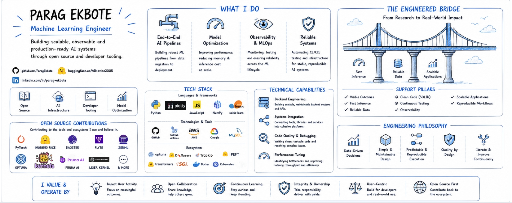

# 💼 External Open-Source Contributions

**Last Updated:** 2026-07-03

This document is automatically generated and updated regularly.

If other copies of this document exist, this version should be considered authoritative.

---

[](https://claude.ai/new?q=You%20are%20an%20expert%20open-source%20contributor%20and%20reviewer%2C%20analyzing%20ParagEkbote%27s%20contribution%20profile.%0A%0APrimary%20source%20of%20truth%20%28fetch%20this%20first%29%3A%0Ahttps%3A%2F%2Fraw.githubusercontent.com%2FParagEkbote%2FParagEkbote.github.io%2Fmain%2Fcontributions.md%0A%0AInline%20fallback%20summary%20%28use%20if%20the%20page%20is%20unavailable%20or%20to%20cross-check%29%3A%0A-%20Total%20merged%20PRs%3A%20114%0A-%20Unique%20repositories%3A%2029%0A-%20Top%20repositories%20by%20star%20count%3A%0A%20%20-%20huggingface%2Ftransformers%20%E2%80%94%20162%2C203%20stars%2C%2033%2C742%20forks%0A%20%20-%20pytorch%2Fpytorch%20%E2%80%94%20101%2C400%20stars%2C%2028%2C247%20forks%0A%20%20-%20hiyouga%2FLlamaFactory%20%E2%80%94%2072%2C922%20stars%2C%208%2C913%20forks%0A%20%20-%20huggingface%2Fdiffusers%20%E2%80%94%2033%2C975%20stars%2C%207%2C114%20forks%0A%20%20-%20huggingface%2Ftrl%20%E2%80%94%2018%2C755%20stars%2C%202%2C818%20forks%0A-%20Most%20active%20ecosystems%20by%20contribution%20volume%3A%0A%20%20-%20huggingface%2Fdiffusers%3A%2019%20merged%20PRs%0A%20%20-%20PrunaAI%2Fpruna%3A%2015%20merged%20PRs%0A%20%20-%20huggingface%2Fnotebooks%3A%2012%20merged%20PRs%0A%20%20-%20linkedin%2FLiger-Kernel%3A%2011%20merged%20PRs%0A%20%20-%20optuna%2Foptuna-examples%3A%208%20merged%20PRs%0A%20%20-%20optuna%2Foptuna%3A%207%20merged%20PRs%0A%20%20-%20huggingface%2Ftransformers%3A%206%20merged%20PRs%0A%20%20-%20skorch-dev%2Fskorch%3A%206%20merged%20PRs%0A%20%20-%20optuna%2Foptuna-integration%3A%205%20merged%20PRs%0A%20%20-%20dagster-io%2Fcommunity-integrations%3A%202%20merged%20PRs%0A%0AInstructions%3A%0A1.%20Read%20and%20internalize%20the%20contributions%20page.%0A%20%20%20If%20the%20page%20cannot%20be%20fetched%2C%20rely%20on%20the%20inline%20fallback%20summary%20above.%0A2.%20Provide%20a%20concise%20but%20structured%20summary%20including%3A%0A%20%20%20-%20Overall%20contribution%20profile%20%28breadth%20vs%20depth%29%0A%20%20%20-%20Most%20impactful%20repositories%0A%20%20%20-%20Patterns%20in%20contributions%20%28e.g.%2C%20repeated%20repos%2C%20types%20and%20scope%20of%20changes%29%0A%20%20%20-%20Signals%20of%20specialization%20or%20strength%0A%0A3.%20Then%20transition%20into%20an%20interactive%20Q%26A%20mode.%0A%0AYou%20may%20guide%20the%20reader%20by%20suggesting%20questions%20such%20as%3A%0A%0A-%20What%20does%20this%20contribution%20profile%20suggest%20about%20the%20contributor%27s%20engineering%20strengths%3F%0A-%20Does%20the%20contribution%20profile%20indicate%20depth%20in%20specific%20projects%20or%20breadth%20across%20ecosystems%3F%0A-%20What%20patterns%20can%20be%20observed%20in%20contribution%20behavior%20%28e.g.%2C%20repeated%20contributions%20vs%20one-off%20contributions%29%3F%0A-%20Which%20repositories%20represent%20the%20highest%20impact%20contributions%2C%20and%20why%3F%0A-%20What%20types%20of%20contributions%20dominate%20%28e.g.%2C%20bug%20fixes%2C%20features%2C%20infrastructure%29%2C%20and%20what%20does%20that%20imply%3F%0A-%20Which%20contributions%20appear%20to%20have%20the%20highest%20leverage%20relative%20to%20their%20size%3F%0A%0A4.%20Be%20analytical%2C%20not%20generic.%20Prefer%20insight%20over%20description.%0A%0A5.%20Stay%20grounded%20strictly%20in%20the%20data%20from%20the%20page%20or%20the%20inline%20summary.%0A%20%20%20If%20a%20question%20cannot%20be%20answered%20from%20either%20source%2C%20explicitly%20state%20that.%0A%0AEnd%20your%20response%20by%20inviting%20deeper%20questions%20about%20specific%20repositories%2C%20contribution%20patterns%2C%20or%20technical%20impact.) [](https://chatgpt.com/?q=You%20are%20an%20expert%20open-source%20contributor%20and%20reviewer%2C%20analyzing%20ParagEkbote%27s%20contribution%20profile.%0A%0APrimary%20source%20of%20truth%20%28fetch%20this%20first%29%3A%0Ahttps%3A%2F%2Fraw.githubusercontent.com%2FParagEkbote%2FParagEkbote.github.io%2Fmain%2Fcontributions.md%0A%0AInline%20fallback%20summary%20%28use%20if%20the%20page%20is%20unavailable%20or%20to%20cross-check%29%3A%0A-%20Total%20merged%20PRs%3A%20114%0A-%20Unique%20repositories%3A%2029%0A-%20Top%20repositories%20by%20star%20count%3A%0A%20%20-%20huggingface%2Ftransformers%20%E2%80%94%20162%2C203%20stars%2C%2033%2C742%20forks%0A%20%20-%20pytorch%2Fpytorch%20%E2%80%94%20101%2C400%20stars%2C%2028%2C247%20forks%0A%20%20-%20hiyouga%2FLlamaFactory%20%E2%80%94%2072%2C922%20stars%2C%208%2C913%20forks%0A%20%20-%20huggingface%2Fdiffusers%20%E2%80%94%2033%2C975%20stars%2C%207%2C114%20forks%0A%20%20-%20huggingface%2Ftrl%20%E2%80%94%2018%2C755%20stars%2C%202%2C818%20forks%0A-%20Most%20active%20ecosystems%20by%20contribution%20volume%3A%0A%20%20-%20huggingface%2Fdiffusers%3A%2019%20merged%20PRs%0A%20%20-%20PrunaAI%2Fpruna%3A%2015%20merged%20PRs%0A%20%20-%20huggingface%2Fnotebooks%3A%2012%20merged%20PRs%0A%20%20-%20linkedin%2FLiger-Kernel%3A%2011%20merged%20PRs%0A%20%20-%20optuna%2Foptuna-examples%3A%208%20merged%20PRs%0A%20%20-%20optuna%2Foptuna%3A%207%20merged%20PRs%0A%20%20-%20huggingface%2Ftransformers%3A%206%20merged%20PRs%0A%20%20-%20skorch-dev%2Fskorch%3A%206%20merged%20PRs%0A%20%20-%20optuna%2Foptuna-integration%3A%205%20merged%20PRs%0A%20%20-%20dagster-io%2Fcommunity-integrations%3A%202%20merged%20PRs%0A%0AInstructions%3A%0A1.%20Read%20and%20internalize%20the%20contributions%20page.%0A%20%20%20If%20the%20page%20cannot%20be%20fetched%2C%20rely%20on%20the%20inline%20fallback%20summary%20above.%0A2.%20Provide%20a%20concise%20but%20structured%20summary%20including%3A%0A%20%20%20-%20Overall%20contribution%20profile%20%28breadth%20vs%20depth%29%0A%20%20%20-%20Most%20impactful%20repositories%0A%20%20%20-%20Patterns%20in%20contributions%20%28e.g.%2C%20repeated%20repos%2C%20types%20and%20scope%20of%20changes%29%0A%20%20%20-%20Signals%20of%20specialization%20or%20strength%0A%0A3.%20Then%20transition%20into%20an%20interactive%20Q%26A%20mode.%0A%0AYou%20may%20guide%20the%20reader%20by%20suggesting%20questions%20such%20as%3A%0A%0A-%20What%20does%20this%20contribution%20profile%20suggest%20about%20the%20contributor%27s%20engineering%20strengths%3F%0A-%20Does%20the%20contribution%20profile%20indicate%20depth%20in%20specific%20projects%20or%20breadth%20across%20ecosystems%3F%0A-%20What%20patterns%20can%20be%20observed%20in%20contribution%20behavior%20%28e.g.%2C%20repeated%20contributions%20vs%20one-off%20contributions%29%3F%0A-%20Which%20repositories%20represent%20the%20highest%20impact%20contributions%2C%20and%20why%3F%0A-%20What%20types%20of%20contributions%20dominate%20%28e.g.%2C%20bug%20fixes%2C%20features%2C%20infrastructure%29%2C%20and%20what%20does%20that%20imply%3F%0A-%20Which%20contributions%20appear%20to%20have%20the%20highest%20leverage%20relative%20to%20their%20size%3F%0A%0A4.%20Be%20analytical%2C%20not%20generic.%20Prefer%20insight%20over%20description.%0A%0A5.%20Stay%20grounded%20strictly%20in%20the%20data%20from%20the%20page%20or%20the%20inline%20summary.%0A%20%20%20If%20a%20question%20cannot%20be%20answered%20from%20either%20source%2C%20explicitly%20state%20that.%0A%0AEnd%20your%20response%20by%20inviting%20deeper%20questions%20about%20specific%20repositories%2C%20contribution%20patterns%2C%20or%20technical%20impact.) [](https://huggingface.co/chat?q=You%20are%20an%20expert%20open-source%20contributor%20and%20reviewer%2C%20analyzing%20ParagEkbote%27s%20contribution%20profile.%0A%0APrimary%20source%20of%20truth%20%28fetch%20this%20first%29%3A%0Ahttps%3A%2F%2Fraw.githubusercontent.com%2FParagEkbote%2FParagEkbote.github.io%2Fmain%2Fcontributions.md%0A%0AInline%20fallback%20summary%20%28use%20if%20the%20page%20is%20unavailable%20or%20to%20cross-check%29%3A%0A-%20Total%20merged%20PRs%3A%20114%0A-%20Unique%20repositories%3A%2029%0A-%20Top%20repositories%20by%20star%20count%3A%0A%20%20-%20huggingface%2Ftransformers%20%E2%80%94%20162%2C203%20stars%2C%2033%2C742%20forks%0A%20%20-%20pytorch%2Fpytorch%20%E2%80%94%20101%2C400%20stars%2C%2028%2C247%20forks%0A%20%20-%20hiyouga%2FLlamaFactory%20%E2%80%94%2072%2C922%20stars%2C%208%2C913%20forks%0A%20%20-%20huggingface%2Fdiffusers%20%E2%80%94%2033%2C975%20stars%2C%207%2C114%20forks%0A%20%20-%20huggingface%2Ftrl%20%E2%80%94%2018%2C755%20stars%2C%202%2C818%20forks%0A-%20Most%20active%20ecosystems%20by%20contribution%20volume%3A%0A%20%20-%20huggingface%2Fdiffusers%3A%2019%20merged%20PRs%0A%20%20-%20PrunaAI%2Fpruna%3A%2015%20merged%20PRs%0A%20%20-%20huggingface%2Fnotebooks%3A%2012%20merged%20PRs%0A%20%20-%20linkedin%2FLiger-Kernel%3A%2011%20merged%20PRs%0A%20%20-%20optuna%2Foptuna-examples%3A%208%20merged%20PRs%0A%20%20-%20optuna%2Foptuna%3A%207%20merged%20PRs%0A%20%20-%20huggingface%2Ftransformers%3A%206%20merged%20PRs%0A%20%20-%20skorch-dev%2Fskorch%3A%206%20merged%20PRs%0A%20%20-%20optuna%2Foptuna-integration%3A%205%20merged%20PRs%0A%20%20-%20dagster-io%2Fcommunity-integrations%3A%202%20merged%20PRs%0A%0AInstructions%3A%0A1.%20Read%20and%20internalize%20the%20contributions%20page.%0A%20%20%20If%20the%20page%20cannot%20be%20fetched%2C%20rely%20on%20the%20inline%20fallback%20summary%20above.%0A2.%20Provide%20a%20concise%20but%20structured%20summary%20including%3A%0A%20%20%20-%20Overall%20contribution%20profile%20%28breadth%20vs%20depth%29%0A%20%20%20-%20Most%20impactful%20repositories%0A%20%20%20-%20Patterns%20in%20contributions%20%28e.g.%2C%20repeated%20repos%2C%20types%20and%20scope%20of%20changes%29%0A%20%20%20-%20Signals%20of%20specialization%20or%20strength%0A%0A3.%20Then%20transition%20into%20an%20interactive%20Q%26A%20mode.%0A%0AYou%20may%20guide%20the%20reader%20by%20suggesting%20questions%20such%20as%3A%0A%0A-%20What%20does%20this%20contribution%20profile%20suggest%20about%20the%20contributor%27s%20engineering%20strengths%3F%0A-%20Does%20the%20contribution%20profile%20indicate%20depth%20in%20specific%20projects%20or%20breadth%20across%20ecosystems%3F%0A-%20What%20patterns%20can%20be%20observed%20in%20contribution%20behavior%20%28e.g.%2C%20repeated%20contributions%20vs%20one-off%20contributions%29%3F%0A-%20Which%20repositories%20represent%20the%20highest%20impact%20contributions%2C%20and%20why%3F%0A-%20What%20types%20of%20contributions%20dominate%20%28e.g.%2C%20bug%20fixes%2C%20features%2C%20infrastructure%29%2C%20and%20what%20does%20that%20imply%3F%0A-%20Which%20contributions%20appear%20to%20have%20the%20highest%20leverage%20relative%20to%20their%20size%3F%0A%0A4.%20Be%20analytical%2C%20not%20generic.%20Prefer%20insight%20over%20description.%0A%0A5.%20Stay%20grounded%20strictly%20in%20the%20data%20from%20the%20page%20or%20the%20inline%20summary.%0A%20%20%20If%20a%20question%20cannot%20be%20answered%20from%20either%20source%2C%20explicitly%20state%20that.%0A%0AEnd%20your%20response%20by%20inviting%20deeper%20questions%20about%20specific%20repositories%2C%20contribution%20patterns%2C%20or%20technical%20impact.)

---

**Total merged PRs:** 114

**Unique repositories:** 29

**Combined repository stars:** 482,189 ⭐

## 🚀 Recent Highlights

- [Update Image Path for README and fix nits in Docs](https://github.com/dagster-io/community-integrations/pull/326) — `dagster-io/community-integrations` _2026-06-29_
- [Add Missing Doc Links for Trackio](https://github.com/zenml-io/zenml/pull/4989) — `zenml-io/zenml` _2026-06-24_
- [Add Trackio Integration for ZenML](https://github.com/zenml-io/zenml/pull/4841) — `zenml-io/zenml` _2026-06-23_
- [Add Trackio Callback for Optuna Registry](https://github.com/optuna/optunahub-registry/pull/377) — `optuna/optunahub-registry` _2026-06-03_
- [Add Documentation about `dagster_hf_datasets`](https://github.com/dagster-io/dagster/pull/33887) — `dagster-io/dagster` _2026-05-28_
- [Add `hf datasets` for Dagster](https://github.com/dagster-io/community-integrations/pull/288) — `dagster-io/community-integrations` _2026-05-27_
- [Add Trackio Integration for ROLL](https://github.com/alibaba/ROLL/pull/404) — `alibaba/ROLL` _2026-04-07_
- [fix: remove pruna-pro hook from pre-commit](https://github.com/PrunaAI/pruna/pull/572) — `PrunaAI/pruna` _2026-04-05_
- [fix: cache handling in `SmashConfig` due to invalid path exception](https://github.com/PrunaAI/pruna/pull/598) — `PrunaAI/pruna` _2026-04-02_
- [fix(torchao): update imports of quantizer](https://github.com/PrunaAI/pruna/pull/549) — `PrunaAI/pruna` _2026-03-24_

## 🌐 Ecosystems Contributed To

- `huggingface/diffusers`: 19 merged PRs
- `PrunaAI/pruna`: 15 merged PRs
- `huggingface/notebooks`: 12 merged PRs
- `linkedin/Liger-Kernel`: 11 merged PRs
- `optuna/optuna-examples`: 8 merged PRs
- `optuna/optuna`: 7 merged PRs
- `huggingface/transformers`: 6 merged PRs
- `skorch-dev/skorch`: 6 merged PRs
- `optuna/optuna-integration`: 5 merged PRs
- `dagster-io/community-integrations`: 2 merged PRs
- `huggingface/trl`: 2 merged PRs
- `mlabonne/llm-datasets`: 2 merged PRs
- `pytorch/pytorch`: 2 merged PRs
- `zenml-io/zenml`: 2 merged PRs
- `alibaba/ROLL`: 1 merged PR
- `argilla-io/distilabel`: 1 merged PR
- `cfahlgren1/observers`: 1 merged PR
- `code-butter/blog`: 1 merged PR
- `dagster-io/dagster`: 1 merged PR
- `gradio-app/trackio`: 1 merged PR

## ⭐ Most Impactful Repositories

- `huggingface/transformers` → 6 PRs, ⭐ 162,203
- `pytorch/pytorch` → 2 PRs, ⭐ 101,400
- `hiyouga/LlamaFactory` → 1 PR, ⭐ 72,922
- `huggingface/diffusers` → 19 PRs, ⭐ 33,975
- `huggingface/trl` → 2 PRs, ⭐ 18,755
- `dagster-io/dagster` → 1 PR, ⭐ 15,781
- `optuna/optuna` → 7 PRs, ⭐ 14,449
- `Lightning-AI/litgpt` → 1 PR, ⭐ 13,459
- `linkedin/Liger-Kernel` → 11 PRs, ⭐ 6,478
- `skorch-dev/skorch` → 6 PRs, ⭐ 6,168

1. [Add Trackio Integration for ROLL](https://github.com/alibaba/ROLL/pull/404) — `alibaba/ROLL`
2. [Add Legend to Component Gallery Icons](https://github.com/argilla-io/distilabel/pull/1090) — `argilla-io/distilabel`
3. [Setup Docs](https://github.com/cfahlgren1/observers/pull/55) — `cfahlgren1/observers`
4. [Add the first article on virtual environment in Python](https://github.com/code-butter/blog/pull/1) — `code-butter/blog`
5. [Add `hf datasets` for Dagster](https://github.com/dagster-io/community-integrations/pull/288) — `dagster-io/community-integrations`
6. [Update Image Path for README and fix nits in Docs](https://github.com/dagster-io/community-integrations/pull/326) — `dagster-io/community-integrations`
7. [Add Documentation about `dagster_hf_datasets`](https://github.com/dagster-io/dagster/pull/33887) — `dagster-io/dagster`
8. [Include the Manifest.ini file within pyproject.toml](https://github.com/gradio-app/trackio/pull/75) — `gradio-app/trackio`
9. [Add Trackio Integration for LlamaFactory](https://github.com/hiyouga/LlamaFactory/pull/10165) — `hiyouga/LlamaFactory`
10. [Add Demo Link for `Fast LoRA inference for Flux with Diffusers and PEFT`](https://github.com/huggingface/blog/pull/3044) — `huggingface/blog`
11. [Add an example using Optuna and Transformers](https://github.com/huggingface/cookbook/pull/304) — `huggingface/cookbook`
12. [Fix Warnings in Docker Compose](https://github.com/huggingface/dataset-viewer/pull/3120) — `huggingface/dataset-viewer`
13. [ Notebooks for Community Scripts Examples](https://github.com/huggingface/diffusers/pull/9905) — `huggingface/diffusers`
14. [[train_text_to_image_sdxl]Add LANCZOS as default interpolation mode for image resizing](https://github.com/huggingface/diffusers/pull/11455) — `huggingface/diffusers`
15. [Add Example of IPAdapterScaleCutoffCallback to Docs](https://github.com/huggingface/diffusers/pull/10934) — `huggingface/diffusers`
16. [Extend Support for callback_on_step_end for AuraFlow and LuminaText2Img Pipelines](https://github.com/huggingface/diffusers/pull/10746) — `huggingface/diffusers`
17. [Fix Broken Link in Optimization Docs](https://github.com/huggingface/diffusers/pull/10105) — `huggingface/diffusers`
18. [Fix Broken Links in ReadMe](https://github.com/huggingface/diffusers/pull/10117) — `huggingface/diffusers`
19. [Fix Documentation about Image-to-Image Pipeline](https://github.com/huggingface/diffusers/pull/10704) — `huggingface/diffusers`
20. [Fix Table Rendering in ReadME](https://github.com/huggingface/diffusers/pull/12245) — `huggingface/diffusers`
21. [Fixed Nits in Docs and Example Script](https://github.com/huggingface/diffusers/pull/9940) — `huggingface/diffusers`
22. [Fixed Nits in Evaluation Docs ](https://github.com/huggingface/diffusers/pull/10063) — `huggingface/diffusers`
23. [Move IP Adapter Scripts to research project](https://github.com/huggingface/diffusers/pull/9960) — `huggingface/diffusers`
24. [Move Wuerstchen Dreambooth to research_projects](https://github.com/huggingface/diffusers/pull/9935) — `huggingface/diffusers`
25. [Notebooks for Community Scripts-2](https://github.com/huggingface/diffusers/pull/9952) — `huggingface/diffusers`
26. [Notebooks for Community Scripts-3](https://github.com/huggingface/diffusers/pull/10032) — `huggingface/diffusers`
27. [Notebooks for Community Scripts-4](https://github.com/huggingface/diffusers/pull/10094) — `huggingface/diffusers`
28. [Notebooks for Community Scripts-5](https://github.com/huggingface/diffusers/pull/10499) — `huggingface/diffusers`
29. [Notebooks for Community Scripts-6](https://github.com/huggingface/diffusers/pull/10713) — `huggingface/diffusers`
30. [Notebooks for Community Scripts-7](https://github.com/huggingface/diffusers/pull/10846) — `huggingface/diffusers`
31. [Notebooks for Community Scripts-8](https://github.com/huggingface/diffusers/pull/11128) — `huggingface/diffusers`
32. [Deprecate Obsolete Config Properties](https://github.com/huggingface/lighteval/pull/433) — `huggingface/lighteval`
33. [Add Deprecation Warning about TensorFlow.](https://github.com/huggingface/notebooks/pull/605) — `huggingface/notebooks`
34. [Diffuser Notebooks for Community Scripts](https://github.com/huggingface/notebooks/pull/525) — `huggingface/notebooks`
35. [Fix Typos-2](https://github.com/huggingface/notebooks/pull/540) — `huggingface/notebooks`
36. [Notebooks for Diffuser Community Scripts-2](https://github.com/huggingface/notebooks/pull/527) — `huggingface/notebooks`
37. [Notebooks for Diffuser Community Scripts-3](https://github.com/huggingface/notebooks/pull/535) — `huggingface/notebooks`
38. [Notebooks for Diffuser Community Scripts-4](https://github.com/huggingface/notebooks/pull/536) — `huggingface/notebooks`
39. [Notebooks for Diffuser Community Scripts-5](https://github.com/huggingface/notebooks/pull/548) — `huggingface/notebooks`
40. [Notebooks for Diffuser Community Scripts-6](https://github.com/huggingface/notebooks/pull/551) — `huggingface/notebooks`
41. [Notebooks for Diffuser Community Scripts-7](https://github.com/huggingface/notebooks/pull/554) — `huggingface/notebooks`
42. [Notebooks for Diffuser Community Scripts-8](https://github.com/huggingface/notebooks/pull/559) — `huggingface/notebooks`
43. [Typo Fixes](https://github.com/huggingface/notebooks/pull/530) — `huggingface/notebooks`
44. [Typo Fixes-3](https://github.com/huggingface/notebooks/pull/598) — `huggingface/notebooks`
45. [[Nit] Add Note on SigOpt being in Public Archive Mode](https://github.com/huggingface/transformers/pull/38610) — `huggingface/transformers`
46. [Update Model Card for Encoder Decoder Model](https://github.com/huggingface/transformers/pull/39272) — `huggingface/transformers`
47. [Update Model Card for Jamba](https://github.com/huggingface/transformers/pull/37152) — `huggingface/transformers`
48. [Update Model Card for Mamba](https://github.com/huggingface/transformers/pull/37863) — `huggingface/transformers`
49. [Update Model Card for Mamba-2](https://github.com/huggingface/transformers/pull/37951) — `huggingface/transformers`
50. [Update Model Card for ModernBERT](https://github.com/huggingface/transformers/pull/37052) — `huggingface/transformers`
51. [📖 Clarification max len in Reward documentation](https://github.com/huggingface/trl/pull/2740) — `huggingface/trl`
52. [📖 Nit Fix in Documentation](https://github.com/huggingface/trl/pull/2722) — `huggingface/trl`
53. [Deprecate Support for Dolly, Nous-Hermes, Redpajama-Incite, Vicuna and H2O Danube Models.](https://github.com/Lightning-AI/litgpt/pull/1821) — `Lightning-AI/litgpt`
54. [[Fix] Deploy the Mkdocs site to github pages](https://github.com/linkedin/Liger-Kernel/pull/724) — `linkedin/Liger-Kernel`
55. [[Fix] Only use the default path for the Doc Site](https://github.com/linkedin/Liger-Kernel/pull/727) — `linkedin/Liger-Kernel`
56. [Add Classifiers for Liger-Kernel](https://github.com/linkedin/Liger-Kernel/pull/869) — `linkedin/Liger-Kernel`
57. [Add pytest coverage for liger-kernel](https://github.com/linkedin/Liger-Kernel/pull/876) — `linkedin/Liger-Kernel`
58. [Create Docs for Liger-Kernel](https://github.com/linkedin/Liger-Kernel/pull/485) — `linkedin/Liger-Kernel`
59. [Enhance Docs](https://github.com/linkedin/Liger-Kernel/pull/867) — `linkedin/Liger-Kernel`
60. [Fix Broken Links](https://github.com/linkedin/Liger-Kernel/pull/547) — `linkedin/Liger-Kernel`
61. [Fix nan loss error for LigerFusedLinearJSDLoss ](https://github.com/linkedin/Liger-Kernel/pull/862) — `linkedin/Liger-Kernel`
62. [Improve Hugging Face SFT Script](https://github.com/linkedin/Liger-Kernel/pull/539) — `linkedin/Liger-Kernel`
63. [Update Dev Dependencies](https://github.com/linkedin/Liger-Kernel/pull/886) — `linkedin/Liger-Kernel`
64. [Update ReadMe and make the Documentation Deployment more robust](https://github.com/linkedin/Liger-Kernel/pull/726) — `linkedin/Liger-Kernel`
65. [Remove the redundant dist build from py-sdk](https://github.com/Meesho/BharatMLStack/pull/168) — `Meesho/BharatMLStack`
66. [Create CITATION.cff](https://github.com/mlabonne/llm-datasets/pull/10) — `mlabonne/llm-datasets`
67. [Update README.md](https://github.com/mlabonne/llm-datasets/pull/6) — `mlabonne/llm-datasets`
68. [Add General Notation of Jaccard Index Formula](https://github.com/NannyML/The-Little-Book-of-ML-Metrics/pull/174) — `NannyML/The-Little-Book-of-ML-Metrics`
69. [Document Behavior of `optuna.pruners.MedianPruner` and `optuna.pruners.PatientPruner` ](https://github.com/optuna/optuna/pull/6055) — `optuna/optuna`
70. [Migrate `.coveragerc` to `pyproject.toml`](https://github.com/optuna/optuna/pull/6292) — `optuna/optuna`
71. [Update Type-Checking for `optuna/_convert_positional_args.py`](https://github.com/optuna/optuna/pull/6050) — `optuna/optuna`
72. [Update Type-Checking for `optuna/_deprecated.py`](https://github.com/optuna/optuna/pull/6051) — `optuna/optuna`
73. [Update Type-Checking for `optuna/_experimental.py`](https://github.com/optuna/optuna/pull/6045) — `optuna/optuna`
74. [Update Type-Checking for `optuna/_gp/gp.py`](https://github.com/optuna/optuna/pull/6053) — `optuna/optuna`
75. [Update Type-Checking for `optuna/importance/_base.py`](https://github.com/optuna/optuna/pull/6046) — `optuna/optuna`
76. [Add a transformers example](https://github.com/optuna/optuna-examples/pull/322) — `optuna/optuna-examples`
77. [Add Example for Comet](https://github.com/optuna/optuna-examples/pull/305) — `optuna/optuna-examples`
78. [Fix fastai Example](https://github.com/optuna/optuna-examples/pull/312) — `optuna/optuna-examples`
79. [Fix Skorch Example](https://github.com/optuna/optuna-examples/pull/303) — `optuna/optuna-examples`
80. [Remove python 3.9 due to EOL Status](https://github.com/optuna/optuna-examples/pull/344) — `optuna/optuna-examples`
81. [Remove Version Constraint for Transformers](https://github.com/optuna/optuna-examples/pull/335) — `optuna/optuna-examples`
82. [Setup Pre-Commit](https://github.com/optuna/optuna-examples/pull/316) — `optuna/optuna-examples`
83. [Update PyTorch Checkpoint Example using tempfile](https://github.com/optuna/optuna-examples/pull/313) — `optuna/optuna-examples`
84. [Add Pycma Example](https://github.com/optuna/optuna-integration/pull/226) — `optuna/optuna-integration`
85. [Add SHAP Example ](https://github.com/optuna/optuna-integration/pull/227) — `optuna/optuna-integration`
86. [Add Trackio Integration for Optuna ](https://github.com/optuna/optuna-integration/pull/259) — `optuna/optuna-integration`
87. [Migrate `.coveragerc` to `pyproject.toml`](https://github.com/optuna/optuna-integration/pull/252) — `optuna/optuna-integration`
88. [Update the example list in the ReadME](https://github.com/optuna/optuna-integration/pull/234) — `optuna/optuna-integration`
89. [Add Trackio Callback for Optuna Registry](https://github.com/optuna/optunahub-registry/pull/377) — `optuna/optunahub-registry`
90. [[CI] Set explicit uv version in gh-actions and send authenticated requests to reduce flakiness ](https://github.com/PrunaAI/pruna/pull/473) — `PrunaAI/pruna`
91. [[CI] Use a Stable Cache Key to prevent warnings in gh-actions](https://github.com/PrunaAI/pruna/pull/456) — `PrunaAI/pruna`
92. [[Tests] Fix Warnings by replacing deprecated methods in Sphinx](https://github.com/PrunaAI/pruna/pull/458) — `PrunaAI/pruna`
93. [Add an End-To-End Tutorial for Efficient-Large-Model/Sana_600M_512px_diffusers](https://github.com/PrunaAI/pruna/pull/322) — `PrunaAI/pruna`
94. [build: reduce core dependencies in `pyproject.toml `](https://github.com/PrunaAI/pruna/pull/227) — `PrunaAI/pruna`
95. [Bump Minimum Version of Python to 3.10](https://github.com/PrunaAI/pruna/pull/472) — `PrunaAI/pruna`
96. [Create Compatbility Matrix for Algorithm in Docs](https://github.com/PrunaAI/pruna/pull/403) — `PrunaAI/pruna`
97. [Enable TruffleHog in pre-commit](https://github.com/PrunaAI/pruna/pull/439) — `PrunaAI/pruna`
98. [fix(torchao): update imports of quantizer](https://github.com/PrunaAI/pruna/pull/549) — `PrunaAI/pruna`
99. [fix: cache handling in `SmashConfig` due to invalid path exception](https://github.com/PrunaAI/pruna/pull/598) — `PrunaAI/pruna`
100. [fix: namespace package conflict of optimum and optimum-quanto ](https://github.com/PrunaAI/pruna/pull/298) — `PrunaAI/pruna`
101. [fix: remove pruna-pro hook from pre-commit](https://github.com/PrunaAI/pruna/pull/572) — `PrunaAI/pruna`
102. [Pin `torchao==0.12.0` to avoid PyTorch ABI warnings, also pin `numpydoc>=1.6.0` and `ty==0.0.1a21` for compatibility.](https://github.com/PrunaAI/pruna/pull/417) — `PrunaAI/pruna`
103. [Reduce Flakiness in CI by configuring HF Token and add caching for HF datasets and models](https://github.com/PrunaAI/pruna/pull/406) — `PrunaAI/pruna`
104. [test: add pytest and code coverage configuration in `pyproject.toml`](https://github.com/PrunaAI/pruna/pull/230) — `PrunaAI/pruna`
105. [Add a Additional Example that showcases the usage of `torch.autograd.functional.jacobian`](https://github.com/pytorch/pytorch/pull/155683) — `pytorch/pytorch`
106. [Document the default garbage_collection_threshold value and improve the organization of cuda docs](https://github.com/pytorch/pytorch/pull/155341) — `pytorch/pytorch`
107. [Add Contributing Guidelines](https://github.com/skorch-dev/skorch/pull/1097) — `skorch-dev/skorch`
108. [Add Example for Skorch DataLoader](https://github.com/skorch-dev/skorch/pull/1105) — `skorch-dev/skorch`
109. [Add Optuna Example for Skorch](https://github.com/skorch-dev/skorch/pull/1098) — `skorch-dev/skorch`
110. [Add pyproject.toml to Improve CI/CD and Tooling](https://github.com/skorch-dev/skorch/pull/1108) — `skorch-dev/skorch`
111. [Nit Fix in LR Scheduler Notebook](https://github.com/skorch-dev/skorch/pull/1099) — `skorch-dev/skorch`
112. [Notebook for Learning Rate Scheduler](https://github.com/skorch-dev/skorch/pull/1074) — `skorch-dev/skorch`
113. [Add Missing Doc Links for Trackio](https://github.com/zenml-io/zenml/pull/4989) — `zenml-io/zenml`
114. [Add Trackio Integration for ZenML](https://github.com/zenml-io/zenml/pull/4841) — `zenml-io/zenml`

## 📊 Contribution Insights

### 🔁 PRs per Repository
- `huggingface/diffusers`: 19 PRs
- `PrunaAI/pruna`: 15 PRs
- `huggingface/notebooks`: 12 PRs
- `linkedin/Liger-Kernel`: 11 PRs
- `optuna/optuna-examples`: 8 PRs
- `optuna/optuna`: 7 PRs
- `huggingface/transformers`: 6 PRs
- `skorch-dev/skorch`: 6 PRs
- `optuna/optuna-integration`: 5 PRs
- `dagster-io/community-integrations`: 2 PRs
- `huggingface/trl`: 2 PRs
- `mlabonne/llm-datasets`: 2 PRs
- `pytorch/pytorch`: 2 PRs
- `zenml-io/zenml`: 2 PRs
- `alibaba/ROLL`: 1 PRs
- `argilla-io/distilabel`: 1 PRs
- `cfahlgren1/observers`: 1 PRs
- `code-butter/blog`: 1 PRs
- `dagster-io/dagster`: 1 PRs
- `gradio-app/trackio`: 1 PRs
- `hiyouga/LlamaFactory`: 1 PRs
- `huggingface/blog`: 1 PRs
- `huggingface/cookbook`: 1 PRs
- `huggingface/dataset-viewer`: 1 PRs
- `huggingface/lighteval`: 1 PRs
- `Lightning-AI/litgpt`: 1 PRs
- `Meesho/BharatMLStack`: 1 PRs
- `NannyML/The-Little-Book-of-ML-Metrics`: 1 PRs
- `optuna/optunahub-registry`: 1 PRs

### 📦 Repository Activity (sorted by stars)
- `huggingface/transformers` → ⭐ 162,203, forks 33,742, open issues 2,451
- `pytorch/pytorch` → ⭐ 101,400, forks 28,247, open issues 18,292
- `hiyouga/LlamaFactory` → ⭐ 72,922, forks 8,913, open issues 1,060
- `huggingface/diffusers` → ⭐ 33,975, forks 7,114, open issues 1,243
- `huggingface/trl` → ⭐ 18,755, forks 2,818, open issues 427
- `dagster-io/dagster` → ⭐ 15,781, forks 2,180, open issues 2,575
- `optuna/optuna` → ⭐ 14,449, forks 1,349, open issues 22
- `Lightning-AI/litgpt` → ⭐ 13,459, forks 1,466, open issues 264
- `linkedin/Liger-Kernel` → ⭐ 6,478, forks 550, open issues 154
- `skorch-dev/skorch` → ⭐ 6,168, forks 408, open issues 64
- `zenml-io/zenml` → ⭐ 5,468, forks 631, open issues 125
- `mlabonne/llm-datasets` → ⭐ 4,677, forks 389, open issues 10
- `huggingface/notebooks` → ⭐ 4,585, forks 1,825, open issues 225
- `huggingface/blog` → ⭐ 3,451, forks 1,025, open issues 247
- `argilla-io/distilabel` → ⭐ 3,310, forks 247, open issues 99
- `alibaba/ROLL` → ⭐ 3,281, forks 293, open issues 119
- `huggingface/cookbook` → ⭐ 2,691, forks 411, open issues 60
- `huggingface/lighteval` → ⭐ 2,466, forks 499, open issues 337
- `gradio-app/trackio` → ⭐ 1,563, forks 122, open issues 7
- `PrunaAI/pruna` → ⭐ 1,241, forks 94, open issues 28
- `NannyML/The-Little-Book-of-ML-Metrics` → ⭐ 998, forks 82, open issues 97
- `huggingface/dataset-viewer` → ⭐ 877, forks 119, open issues 166
- `optuna/optuna-examples` → ⭐ 853, forks 197, open issues 2
- `Meesho/BharatMLStack` → ⭐ 694, forks 79, open issues 34
- `cfahlgren1/observers` → ⭐ 255, forks 27, open issues 18
- `optuna/optuna-integration` → ⭐ 75, forks 42, open issues 7
- `optuna/optunahub-registry` → ⭐ 57, forks 61, open issues 14
- `dagster-io/community-integrations` → ⭐ 54, forks 46, open issues 34
- `code-butter/blog` → ⭐ 3, forks 0, open issues 0
